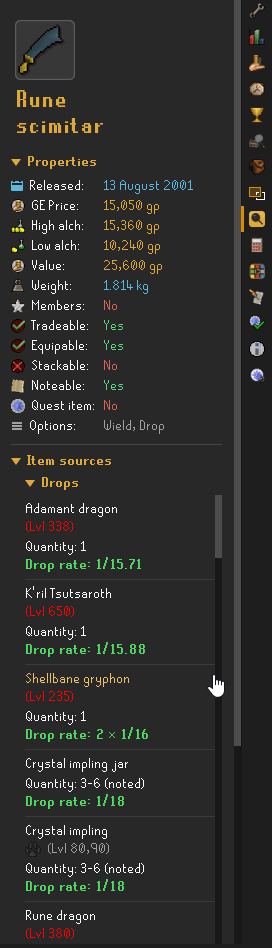
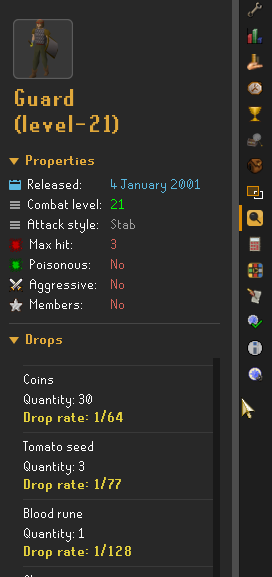

# Quick Wiki

A RuneLite plugin that adds a "Wiki" option to the right-click menu on items, NPCs, and objects. Click it and the wiki entry shows up in a side panel — description, stats, drop sources, shop locations, and more, without ever leaving the game.

## Why

Examining an item, NPC, or object in-game just gives you a one-line description — no price, no stats, no drop info. So you end up alt-tabbing out to a browser to look it up on the wiki. That means a separate window, breaking out of fullscreen, losing sight of the game while it's still running in the background — just to check a price or a drop rate.

This puts all of that directly in a side panel inside the client itself. No alt-tab, no second window, no losing your place. You stay in the game the whole time.

## Features

- **Items** — description, GE price, high/low alch, release date, members status, quest item flag, tradeable/equipable/stackable/noteable, right-click options, value, weight, and the item's image
- **NPCs** — description, image, combat level (color-coded relative to your own), race, attack style, max hit, aggressive/poisonous flags, slayer level, and their full drop table
- **Objects** — description, image, release date, members status, quest requirement, and interaction options
- **Click-through navigation** — click any monster in an item's drop sources, or any item in a monster's drop table, to jump straight to that page's own info. A back button returns you to wherever you started
- **Shops** — see every shop that sells an item and at what price, including non-GP currencies like Slayer Reward points

<table>
<tr>

<td align="center"><b>Item sources</b> </td>
<td align="center"><b>NPC drops and stats</b> </td>

</tr>
</table>

## Item sources

Expand "Item Sources" on any item to see every monster that drops it and every shop that sells it, sorted most-common-first with color-coded drop rates.

## NPC drops and stats

Right-click any monster to see its full combat stats and its own drop table — no need to look up the item first to find out what drops it.

## Jump between pages without leaving the panel

Click any item or monster name inside a drop table to go straight to its own page. Use the back button (top-left) to return to whatever you originally looked up.

## Accuracy

A lot of items and NPCs share the same name (there are several NPCs named "Alan", for example, and items like the toxic blowpipe have charged/uncharged versions with different stats). Instead of just searching the wiki by name, this plugin looks up the exact in-game ID of whatever you clicked and matches it against the wiki's structured data, so you get the right page instead of a random namesake.

## Install

Search "Quick Wiki" in the RuneLite Plugin Hub.

## Usage

Right-click something → Wiki → panel opens with the info.

## Issues / feedback

Open an issue on this repo if something's broken, missing, or if the info shown for an item, NPC, or object looks wrong.

## Support

If this plugin's been useful to you, you can [buy me a coffee](https://buymeacoffee.com/jacob6444).

## License

See [LICENSE](LICENSE).
