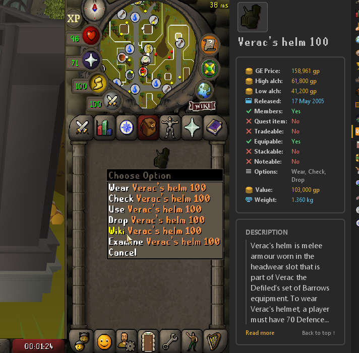
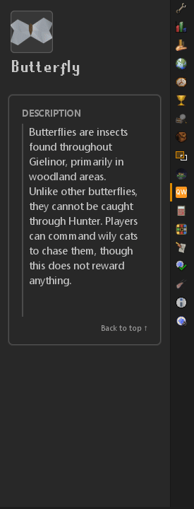

# Quick Wiki

A RuneLite plugin that adds a "Wiki" option to the right-click menu on items, NPCs, and objects. Click it and the wiki entry shows up in a side panel — description, GE price, alch values, release date, and other stats.

## Why

Examining an item, NPC, or object in-game just gives you a one-line description — no price, no stats, no extra detail. So you end up alt-tabbing out to a browser to look it up on the wiki. That means a separate window, breaking out of fullscreen, losing sight of the game while it's still running in the background — just to check a price or read a description.

This puts all of that directly in a side panel inside the client itself. No alt-tab, no second window, no losing your place. You stay in the game the whole time.

<table>
<tr>
<td></td>
<td></td>
</tr>
</table>

## What it shows

For items: description, GE price, high/low alch, release date, members status, quest item flag, tradeable/equipable/stackable/noteable, right-click options, value, weight, and the item's image.

For NPCs and objects: description and image.

## Accuracy

A lot of items and NPCs share the same name (there are several NPCs named "Alan", for example, and items like the toxic blowpipe have charged/uncharged versions with different stats). Instead of just searching the wiki by name, this plugin looks up the exact in-game ID of whatever you clicked and matches it against the wiki's structured data, so you get the right page instead of a random namesake.

## Install

Search "Quick Wiki" in the RuneLite Plugin Hub.

## Usage

Right-click something → Wiki → panel opens with the info.

## Issues / feedback

Open an issue on this repo if something's broken, missing, or if the info shown for an item, NPC, or object looks wrong.

## Support

If this plugin's been useful to you, you can [buy me a coffee](https://buymeacoffee.com/jacob6444).

## License

See [LICENSE](LICENSE).

