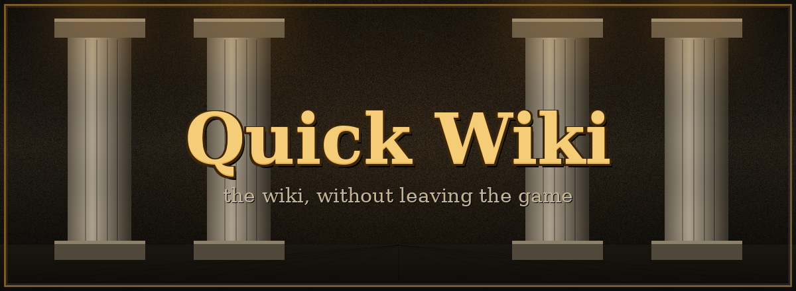
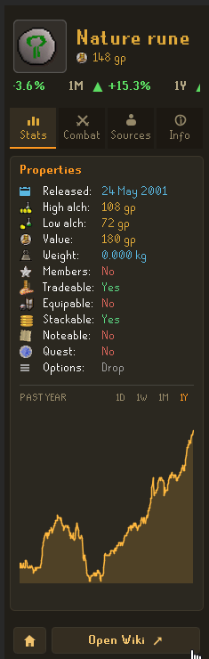

  

  

Stop alt-tabbing to the wiki. Right-click an item, NPC, or object, hit **Wiki**, and the stuff you'd normally go look up shows up in a panel right in the client: price, drops, how it's made, all of it.

  

Examining something in game tells you almost nothing. What drops it? What's the alch? What do I need to make it? That's usually a browser tab and a break from whatever you were doing. This keeps it next to the game instead.

## What you get

- A live GE price with a graph you can hover for any day's price, plus a ticker showing the move over the day, week, month, and year.
- Every monster that drops an item, with quantities and drop rates, sorted by rarity.
- Full recipes for anything you make yourself: the materials and amounts, the skill levels, and where to make it (furnace, blast furnace, and so on), with each method listed separately when there's more than one.
- The shops that sell it and for how much, slayer points and other currencies included.
- Combat stats for NPCs and equipment bonuses for gear.
- Reward caskets and raid chests show their actual loot, not an empty list.
- Click any monster or item to jump to its page, with back and home buttons to retrace your steps.

  

The drops, shops, and recipe lists share the panel so you can see all of them at once, and you can collapse whichever ones you don't need.

## Hotkey

Don't want to open the menu every time? Turn on hotkey mode, then hold a key (backtick by default) and left-click anything to open its panel straight away.

## It finds the right page

Loads of things share a name, and plenty of items have charged, uncharged, or dose variants on separate pages. Instead of searching by name it uses the exact in-game id of whatever you clicked, so you get the right entry instead of a guess. The awkward cases are covered too: degraded Barrows pieces fall back to the base item's drops, and coins link out to the wiki instead of trying to load thousands of drop rows.

## Install

On the RuneLite Plugin Hub. Search for Quick Wiki.

## Bugs and suggestions

Open an issue if something's broken, missing, or looks wrong.

## License

See [LICENSE](LICENSE).
